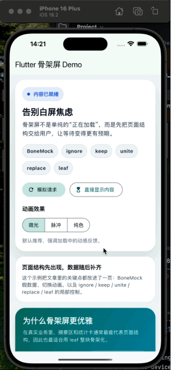

# skeleton_screen_demo

一个基于 `skeletonizer` 的 Flutter 骨架屏示例，覆盖了文章里提到的这些点：

- 基础骨架屏切换
- `BoneMock` 假数据占位
- `Shimmer`、`Pulse`、纯色三种效果切换
- `Skeleton.ignore`
- `Skeleton.keep`
- `Skeleton.unite`
- `Skeleton.replace`
- `Skeleton.leaf`

### 文章地址[]

### 展示图
